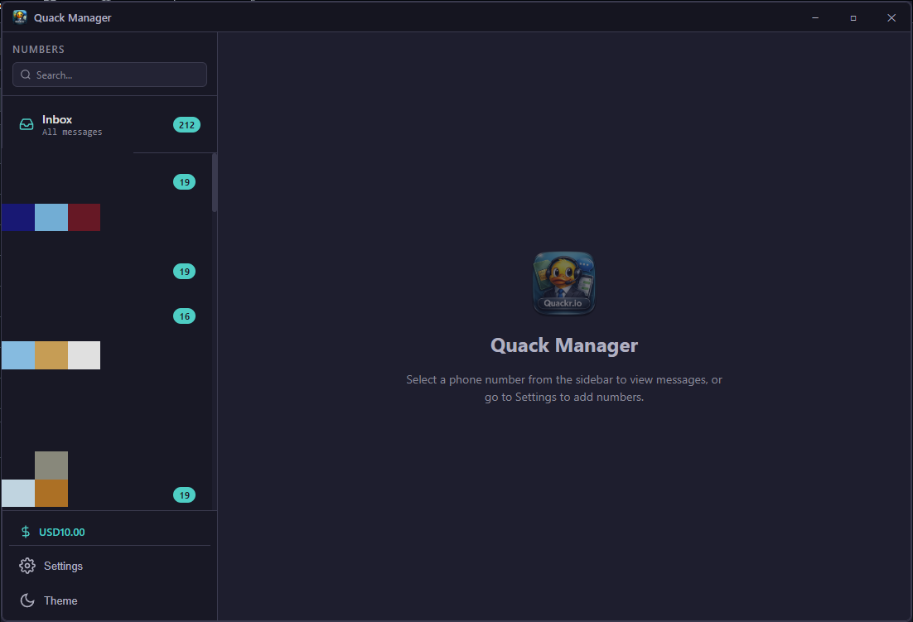
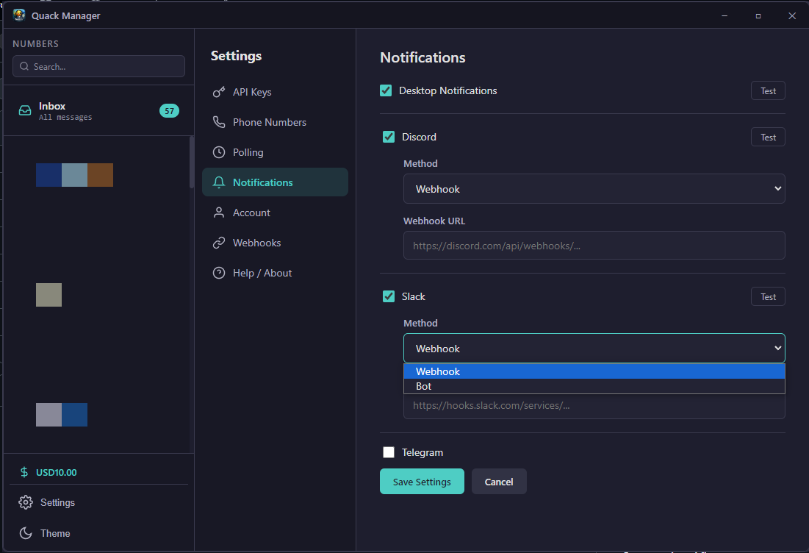
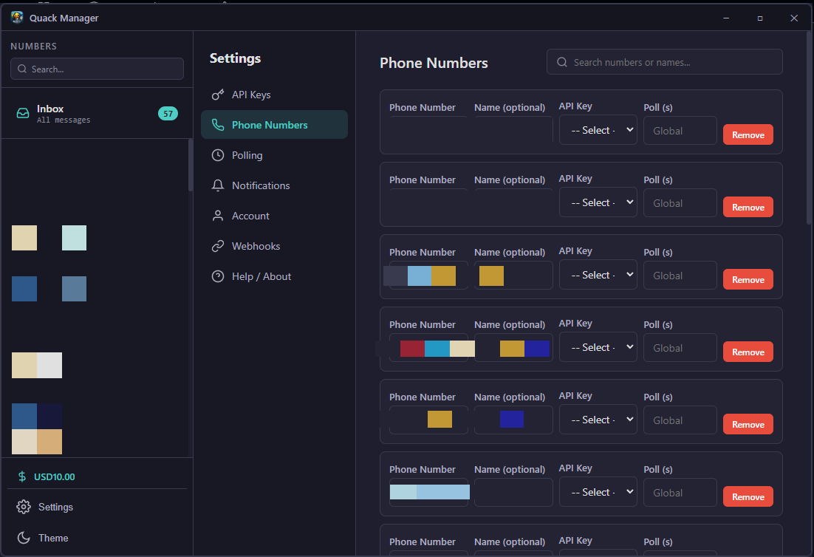
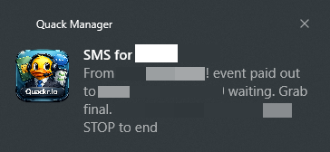
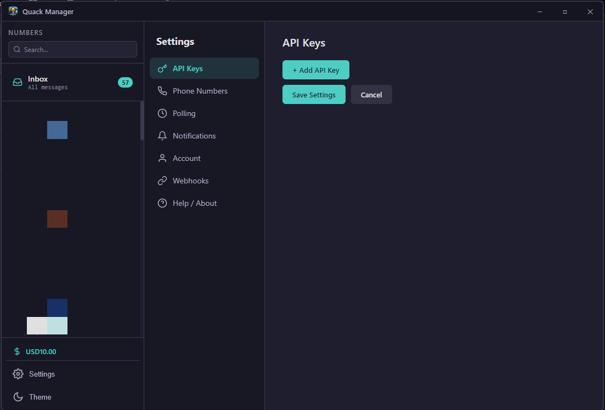
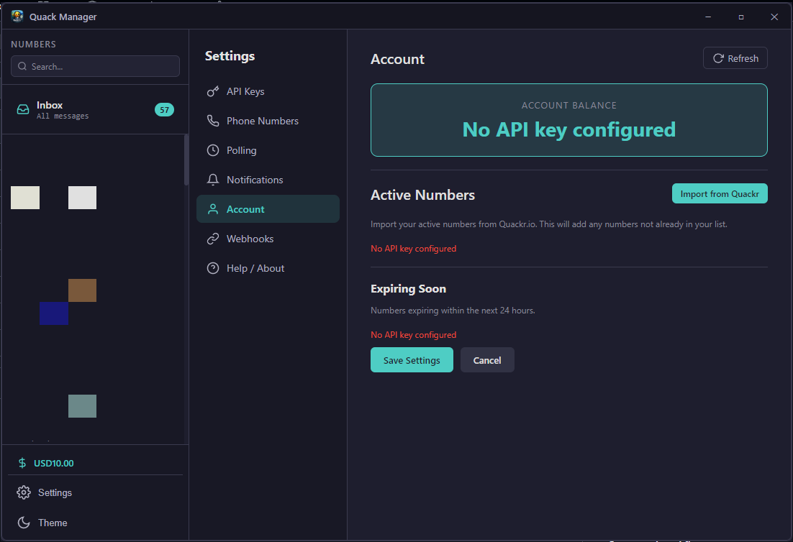
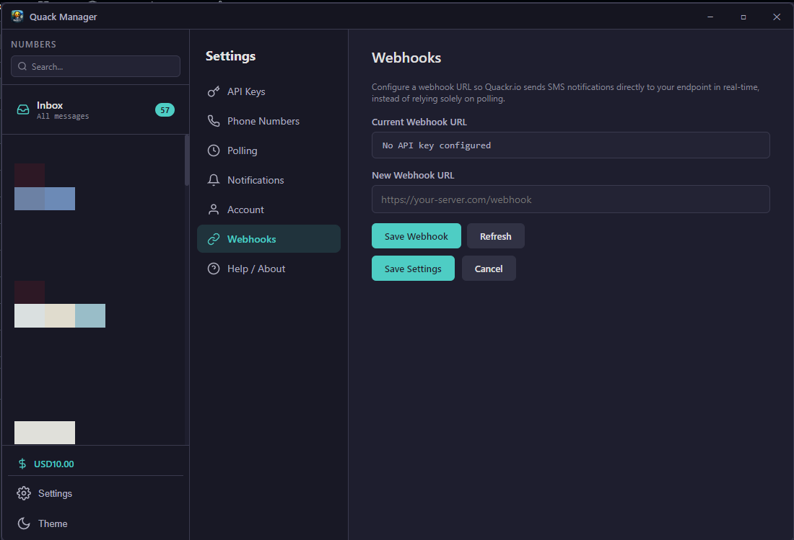
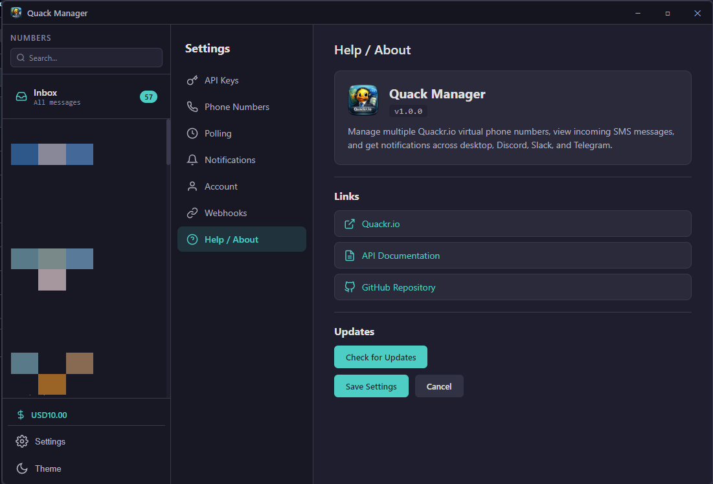

<p align="center">
  
</p>

<h1 align="center">Quack Manager</h1>

<p align="center">
  A desktop app for managing multiple <a href="https://quackr.io">Quackr.io</a> virtual phone numbers and incoming SMS messages.
</p>

<p align="center">
  
  
</p>

---

## Screenshots

<p align="center">
  
</p>
<p align="center"><em>Dashboard with sidebar, inbox, unread badges, and account balance</em></p>

<p align="center">
  
</p>
<p align="center"><em>Notification settings with Discord, Slack, and Telegram support</em></p>

<p align="center">
  
</p>
<p align="center"><em>Manage phone numbers with custom names, API key assignment, and per-number polling</em></p>

<p align="center">
  
</p>
<p align="center"><em>Desktop notifications for incoming SMS</em></p>

<details>
<summary>More screenshots</summary>

<p align="center">
  
</p>
<p align="center"><em>Tabbed settings with API Keys, Phone Numbers, Polling, Notifications, Account, Webhooks, and Help</em></p>

<p align="center">
  
</p>
<p align="center"><em>Account overview with balance, active numbers, and expiring numbers</em></p>

<p align="center">
  
</p>
<p align="center"><em>Webhook configuration for real-time SMS delivery</em></p>

<p align="center">
  
</p>
<p align="center"><em>Help section with links and update checker</em></p>

</details>

## Features

- **Unified Inbox** - View all SMS messages from all numbers in one place
- **Multi-number management** - Add unlimited Quackr.io phone numbers with custom names
- **Multi-API key support** - Use different API keys for different numbers
- **Smart polling** - Configurable global poll interval with per-number overrides
- **Notifications** - Get alerted via:
  - Desktop notifications
  - Discord (webhook or bot)
  - Slack (webhook or bot)
  - Telegram (bot)
- **Account management** - View balance, active numbers, expiry warnings, and import numbers directly from Quackr
- **Webhook configuration** - Set up webhook URLs for real-time SMS delivery
- **Unread tracking** - Badges for unread messages, mark as read, mark all read
- **Search** - Filter numbers in the sidebar
- **Dark / Light theme** - Toggle between dark charcoal and light themes
- **Update checker** - Check for new releases from GitHub

## Getting Started

### Prerequisites

- [Node.js](https://nodejs.org/) (v18+)
- A [Quackr.io](https://quackr.io) account with an API key

### Installation

```bash
git clone https://github.com/GoblinRules/quack-manager.git
cd quack-manager
npm install
npm start
```

### Setup

1. Open **Settings** from the sidebar
2. Go to **API Keys** and add your Quackr.io API key
3. Go to **Phone Numbers** and add numbers to monitor (or use **Account > Import from Quackr** to auto-import)
4. Configure **Notifications** if you want Discord, Slack, or Telegram alerts
5. Messages will start appearing automatically

## Tech Stack

- [Electron](https://www.electronjs.org/) - Desktop app framework
- [electron-store](https://github.com/sindresorhus/electron-store) - Persistent settings storage
- Vanilla HTML/CSS/JS - No heavy frameworks
- [Quackr.io API](https://api.quackr.io) - SMS service

## Project Structure

```
quack-manager/
├── assets/
│   ├── icon2.png            # App icon
│   └── screenshots/         # App screenshots
├── src/
│   ├── index.html           # App shell
│   ├── styles.css           # Dark/light theme styles
│   ├── renderer.js          # Dashboard UI logic
│   └── settings.js          # Settings panel logic
├── main.js                  # Electron main process, polling engine, notifications
├── preload.js               # Secure IPC bridge
└── package.json
```

## License

MIT
